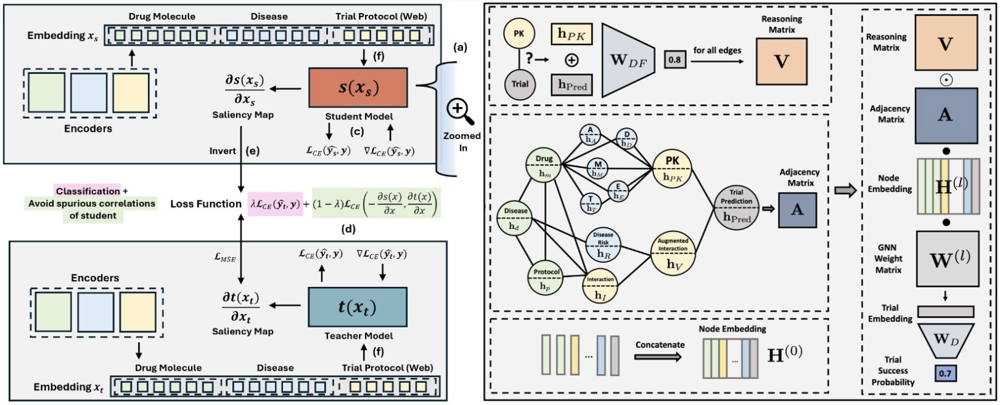

# Improving Clinical Trial Outcome Prediction
### Causal Machine Unlearning with Student-Teacher HINT & LLM-Augmented Data

---

## Authors
- **Teddy Ganea**  
  *Department of Mathematics, Department of Classics, Stanford University*  
  <tganea@stanford.edu>

- **Simon Pritchard**  
  *Department of Biology, Department of Statistics, Stanford University*  
  <skpritch@stanford.edu>

- **Jacob Rubenstein**  
  *Department of Mathematics, Department of D Policy, Stanford University*  
  <jacobr1@stanford.edu>

---

## Overview

This repository extends the **Hierarchical Interaction Network (HINT)** for clinical trial outcome prediction. It addresses two main challenges:

1. **Data Augmentation**: We significantly expand the HINT dataset with new clinical trial records, many of which are *self-supervisedly labeled* using large language models (LLMs). This includes:
   - Scraping more recent trials from ClinicalTrials.gov.  
   - Reformatting and incorporating additional data that the original HINT team had excluded.  
   - Mapping diseases to ICD-10 codes and drugs to SMILES for a richer multimodal dataset.  
   - Applying TF-IDF, PCA, and k-NN to transform unstructured trial text into more compact embeddings.

2. **Student-Teacher Learning**: We integrate a novel **dynamic UnLearning from Experience (dULE)** paradigm into the HINT model. Inspired by causal unlearning literature, we employ a *student-teacher* framework to help the model ignore spurious correlations present in the training data.



- Both models share the same base architecture (from **HINT**) but maintain **separate weights**.
- The **student** learns via a standard **binary cross-entropy (BCE)** loss.
- The **teacher** optimizes a **specialized loss** combining:
  - BCE loss
  - A penalty term that discourages alignment with spurious, “easy” gradients from the student.
- A **dynamic scalar λ** increases over training, giving the teacher model more freedom to **deviate from the student’s spurious correlations**.

This README unifies our work on:
   - Student-Teacher_HINT – Our augmented HINT model with student-teacher training and dynamic unlearning.
   - Self-Supervised_Data_Augmentation – Our scripts for web scraping, LLM-based data labeling, feature extraction, and data cleaning.

## Student-Teacher_HINT

### Contents

#### Model Training & Evaluation
- `Eval/train_mse.py` and `Eval/train_cos.py` train the model on a specified data set using either a cosine similarity or mse-based loss teacher loss function with the ability to parameterize **lambda** and **delta**
- `Eval/train_cos.sh` and `Eval/train_mse.sh` set up parameterized runs on a cluster. 
- `Eval/out_graphs.py` helps visualize training and validation losses, accuracy, and other metrics based on a cluster run .out file.
- `Eval/inference.py` runs through saved checkpoint models and performs test validation
- Checkpoints are stored in `save_model/`.
- pkl files from running inference are stored in `results/`.

#### Encoders & Utilities
- `HINT/molecule_encode.py`, `HINT/icdcode_encode.py`, `HINT/protocol_encode.py` – Modules for converting structured (SMILES, ICD-10 codes) and unstructured text data into numerical embeddings.
- **BioBERT** (or **TF-IDF + PCA** in alternative runs) used for textual embeddings.

#### Student-Teacher Model
- Implemented in `HINT/model.py`.
   -  Includes the custom **dULE loss** function and logic for **teacher-student parallel training**.
- `HINT/dataloader.py` implements dataloaders for the dULE HINT model
---

## Self-Supervised_Data_Augmentation

### Contents

#### Web Scraping & Data Mapping
- `Webscraping_and_ICD10-SMILES_Mapping`: Scripts to pull clinical trial data from ClinicalTrials.gov and map them to **ICD-10** disease codes and **SMILES** strings for drug molecules.

#### Textual Feature Extraction & Dimensionality Reduction
- `TF-IDF_and_PCA_Calculations`:
  - Generates **TF-IDF embeddings** for eligibility criteria text.
  - Applies **PCA** (trained only on the training set) to reduce high-dimensional features into ~50 principal components.
  - For validation and test sets, uses a **k-NN approach** to ensure consistent embeddings aligned with the training distribution.

#### Data Cleaning & Inclusion
- `Data_Cleaning`: Scripts that remove formatting inconsistencies, invalid trials, or incomplete fields.
- `Squeezing_Extra_Trials_Unused_by_HINT`: Incorporates additional data the original HINT pipeline excluded, focusing on **interventional trials with validated outcomes**.

#### LLM-Based Self-Supervised Labeling
- We utilized **GPT-3.5** to label thousands of newly gathered trials as “success” or “failure,” achieving ~**71–85% accuracy** based on small manual checks.
- This process, while imperfect, **greatly enlarged our dataset**, enabling more robust training.

#### Data Quality & Visualization
- `Data_Quality_Visualization`: Contains scripts and notebooks to **evaluate labeling accuracy** and **visualize the distribution** of newly added trials.

#### Finalized Datasets
- `Finalized_Datasets`: Combined data (**original HINT + newly labeled**) consolidated into **train/val/test splits**, ready for `Student-Teacher_HINT` training.

## Getting Started

### Clone the Repository

Clone this repository and navigate to the project root:
```bash
git clone https://github.com/YOUR_USERNAME/ClinicalTrialUnlearning.git
cd ClinicalTrialUnlearning
```
---

### BioBert Embeddings
Will need to download the pre-trained biobert encoder:
   - Download from: https://www.dropbox.com/scl/fi/b8xw5b4kqhwrzhi63jowu/biobert_v1.1_pubmed_pytorch_model.tar.gz?rlkey=cw27hs1x6lamapefeohj7ucwv&e=1
   - Duplicate and place in the Student-Teacher_HINT and Student_Teacher_HINT/Eval directories
---
###  Environment Setup

We recommend using **conda** for environment management.

Depending on your system (Silicon M1, M2; or Windows), use either:
```bash
conda env create --name HINT_env --file silicon-conda.yml
conda env create --name HINT_env --file windows-conda.yaml
```
After setting up your environment, manually install BioBERT:
```bash
pip install biobert-embedding==0.1.2 --no-deps
```
---
### Data & Directories

- Ensure your directory structure matches the layout described above.
- Place your finalized `dULE_HINT.png` file in the root directory if you want the main architecture figure to appear in the top-level `README`.
---
### Running the Student-Teacher Model

1. Navigate to the `Student-Teacher_HINT/` directory.
2. Update any file paths in `train.py` to point to your processed data.
3. Run the training script.
4. Monitor logs and results in the console or by visualizing metrics with `out_graphs.py`.
---
### Data Augmentation
To replicate the web scraping or labeling pipeline:
- Explore the scripts in `Self-Supervised_Data_Augmentation/Webscraping_and_ICD10-SMILES_Mapping/`.
- GPT-based labeling requires an **OpenAI API key** (or similar). The scripts will prompt you to enter your key when needed.

## Credits & Acknowledgments

### Original HINT Model
We build upon the **Hierarchical Interaction Network (HINT)** by *Fu et al. (2021)*.  
We thank the authors for releasing code, pretrained weights, and a curated dataset, which served as our baseline.

---

### Dataset & Labeling

- The original **HINT dataset** is credited to *Fu et al.* and the **IQVIA** team for labeling and curation.
- Additional clinical trial data is sourced from **ClinicalTrials.gov**.
- LLM-based labeling was performed using **GPT-3.5** from **OpenAI**.

---

### Causal Unlearning Approach

Our **UnLearning from Experience (ULE)** and **dynamic UnLearning from Experience (dULE)** approach is inspired by *Mitchell et al. (2024)*, and adapted for **text-based, multimodal contexts** in clinical trial outcome prediction.

---

### Contributors

- **Teddy Ganea**: Designed the dULE methods, coded the student-teacher environment, and developed the TF-IDF/PCA pipeline
- **Simon Pritchard**: Configured environment setup, system-level integration, cluster-based training runs, and engineering to ensure reproducible training scripts.
- **Jacob Rubenstein**: Handled data scraping, prompt engineering for LLM-based labeling, and curated the augmented dataset.

We also thank all **open-source developers** whose tools and libraries (e.g., *PyTorch, scikit-learn, NumPy*) made this project possible.

---

### References

- *Fu et al. (2021)* – Original HINT publication.
- *Mitchell et al. (2024)* – UnLearning from Experience.
- *Zheng et al. (2022)* – LIFTED approach for multimodal clinical trial outcome prediction.
- *Wong et al. (2018)* – Drug development cost estimates.

